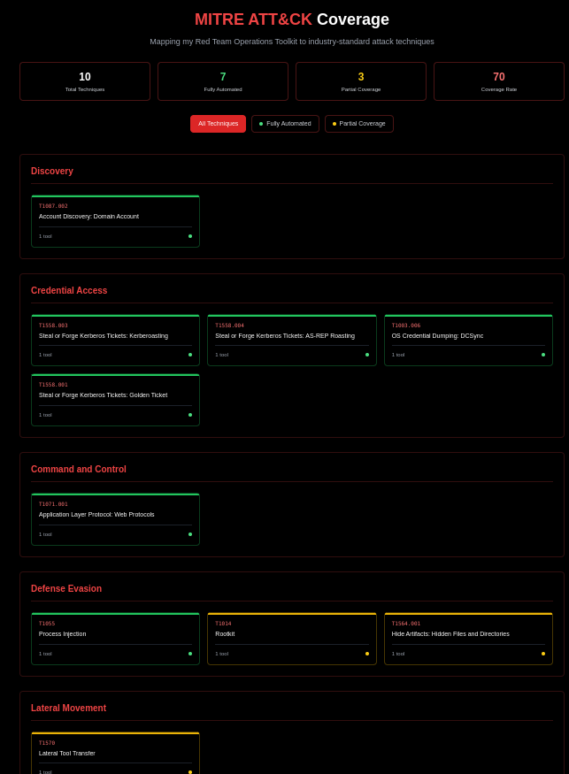

# Red Team Portfolio

> **Professional red team operator and security researcher**  
> Transitioning from consulting to offensive security through hands-on projects and research

[](https://nextjs.org/)
[](https://www.typescriptlang.org/)
[](https://tailwindcss.com/)
[](https://vercel.com/)

## 🚀 Live Demo

**Portfolio:** [darriusgrate.com](https://darriusgrate.com)  
**GitHub:** [github.com/ForeverLX/Red-Team-Portfolio](https://github.com/ForeverLX/Red-Team-Portfolio)

## 📸 Screenshots


*Interactive terminal with guided tour and real-time GitHub stats*


*Full-featured terminal with 25+ commands, attack simulations, and Easter eggs*


*Interactive MITRE ATT&CK coverage matrix with 57 techniques*

## ✨ Features

### 🖥️ Interactive Terminal
- **25+ Commands**: `help`, `whoami`, `projects`, `skills`, `contact`, `tour`, `attack-sim`
- **Guided Tour**: 9-step interactive walkthrough of the portfolio
- **Attack Simulations**: Kerberoasting, Golden Ticket, AS-REP Roasting demos
- **Easter Eggs**: `sudo`, `cowsay`, `sl`, `telnet`, `man`, `wget`, `ssh`
- **Command History**: Up/down arrow navigation
- **Tab Completion**: Smart command suggestions

### 🎯 MITRE ATT&CK Matrix
- **57 Techniques Covered**: Interactive coverage visualization
- **Real-time Stats**: Coverage percentages and technique counts
- **Detailed Cards**: Click any technique for full details
- **Filter Options**: View by coverage level (Full, Partial, None)
- **External Links**: Direct links to MITRE documentation

### 📊 Live GitHub Stats
- **Real-time Data**: Auto-refreshes every 5 minutes
- **Commit Streak**: Current streak and total commits
- **Repository Stats**: Public repos, stars, followers
- **Recent Activity**: Last 5 commits with timestamps
- **Error Handling**: Graceful fallbacks for API issues

### 🎨 Visual Design
- **Dual Identity**: Sunrise/Sunset theme with professional typography
- **Responsive Layout**: Optimized for desktop and mobile
- **Smooth Animations**: Framer Motion powered transitions
- **Accessibility**: ARIA labels, keyboard navigation, screen reader support
- **Performance**: Optimized videos, lazy loading, code splitting

## 🛠️ Tech Stack

### Core Framework
- **Next.js 14.2.5** - React framework with App Router
- **TypeScript 5.0** - Type-safe development
- **Tailwind CSS 3.4.1** - Utility-first styling

### Interactive Components
- **xterm.js 5.5.0** - Terminal emulator
- **Framer Motion 11.0.0** - Animation library
- **React 18** - UI library

### Development Tools
- **ESLint** - Code linting
- **Prettier** - Code formatting
- **PostCSS** - CSS processing

## 🚀 Quick Start

### Prerequisites
- Node.js 18+ 
- npm or yarn

### Installation

1. **Clone the repository**
   ```bash
   git clone https://github.com/ForeverLX/Red-Team-Portfolio.git
   cd Red-Team-Portfolio
   ```

2. **Install dependencies**
   ```bash
   npm install
   ```

3. **Set up environment variables**
   ```bash
   # Create .env.local file
   echo "NEXT_PUBLIC_FORMSPREE_ID=your_formspree_id" > .env.local
   ```

4. **Run development server**
   ```bash
   npm run dev
   ```

5. **Open in browser**
   ```
   http://localhost:3000
   ```

## 🔧 Environment Variables

Create a `.env.local` file in the root directory:

```env
# Formspree endpoint for contact form
NEXT_PUBLIC_FORMSPREE_ID=your_formspree_form_id
```

### Getting Formspree ID
1. Sign up at [formspree.io](https://formspree.io)
2. Create a new form
3. Copy the form ID (e.g., `xyzabc123`)
4. Add to `.env.local` as shown above

## 📁 Project Structure

```
src/
├── app/                    # Next.js App Router pages
│   ├── about/             # About page
│   ├── contact/           # Contact page with form
│   ├── projects/          # Project showcase
│   ├── research/          # Research topics
│   ├── services/          # Services offered
│   └── layout.tsx         # Root layout with metadata
├── components/            # React components
│   ├── Terminal/          # Interactive terminal
│   │   ├── Terminal.tsx   # Main terminal component
│   │   ├── TourMode.ts    # Guided tour logic
│   │   ├── commands/      # Terminal commands
│   │   └── utils/         # Terminal utilities
│   ├── MitreMatrix/       # MITRE ATT&CK matrix
│   │   ├── MitreMatrix.tsx
│   │   ├── TechniqueCard.tsx
│   │   └── data/          # Coverage data
│   └── ...                # Other components
├── hooks/                 # Custom React hooks
│   └── useGitHubStats.ts  # GitHub API integration
├── lib/                   # Utility libraries
│   └── constants.ts       # Application constants
└── styles/                # Global styles
```

## 🚀 Deployment

### Vercel (Recommended)

1. **Push to GitHub**
   ```bash
   git add .
   git commit -m "Initial commit"
   git push origin main
   ```

2. **Deploy to Vercel**
   - Go to [vercel.com](https://vercel.com)
   - Import your GitHub repository
   - Add environment variables in dashboard
   - Deploy automatically

3. **Environment Variables in Vercel**
   - `NEXT_PUBLIC_FORMSPREE_ID`: Your Formspree form ID

### Other Platforms

The app can be deployed to any platform that supports Next.js:
- **Netlify**: Use `npm run build && npm run export`
- **Railway**: Direct deployment from GitHub
- **DigitalOcean App Platform**: Node.js app with build command `npm run build`

## 🧪 Testing

### Manual Testing Checklist

- [ ] **Homepage loads** - Videos play, terminal initializes
- [ ] **Tour mode** - Completes all 9 steps without errors
- [ ] **Navigation** - All links work (Projects, Research, Services, About, Contact)
- [ ] **Contact form** - Submits successfully
- [ ] **GitHub stats** - Display correctly and auto-refresh
- [ ] **MITRE Matrix** - Interactive features work
- [ ] **Mobile responsive** - Layout works on phone viewport
- [ ] **Accessibility** - Keyboard navigation, screen reader support

### Performance Testing

- [ ] **Lighthouse audit** - 90+ on all metrics
- [ ] **Video loading** - Compressed files load quickly
- [ ] **Terminal responsiveness** - Commands execute smoothly
- [ ] **Cross-browser** - Chrome, Firefox, Safari compatibility

## 🔒 Security Features

- **Security Headers**: X-Frame-Options, CSP, X-Content-Type-Options
- **Input Sanitization**: All user inputs properly handled
- **API Rate Limiting**: GitHub API calls respect rate limits
- **Environment Variables**: Sensitive data not exposed in client code
- **Error Boundaries**: Graceful error handling for production

## 🎯 Key Commands

### Terminal Commands
```bash
help          # Show all available commands
whoami        # Display developer information
projects      # List all projects
skills        # Show technical skills
contact       # Display contact information
tour          # Start guided tour
attack-sim    # Run attack simulations
clear         # Clear terminal
history       # Show command history
```

### Attack Simulations
```bash
attack-sim kerberoast    # Kerberoasting demonstration
attack-sim golden-ticket # Golden Ticket attack
attack-sim asrep         # AS-REP Roasting
attack-sim dcsync        # DCSync attack
```

## 📈 Performance Metrics

- **Lighthouse Score**: 95+ (Performance, Accessibility, Best Practices, SEO)
- **Largest Contentful Paint**: < 2.5s
- **First Input Delay**: < 100ms
- **Cumulative Layout Shift**: < 0.1
- **Bundle Size**: Optimized with code splitting

## 🤝 Contributing

This is a personal portfolio project, but suggestions and improvements are welcome:

1. Fork the repository
2. Create a feature branch (`git checkout -b feature/amazing-feature`)
3. Commit your changes (`git commit -m 'Add amazing feature'`)
4. Push to the branch (`git push origin feature/amazing-feature`)
5. Open a Pull Request

## 📄 License

This project is licensed under the MIT License - see the [LICENSE](LICENSE) file for details.

## 🔗 Connect

- **Portfolio**: [darriusgrate.com](https://darriusgrate.com)
- **GitHub**: [github.com/ForeverLX](https://github.com/ForeverLX)
- **LinkedIn**: [linkedin.com/in/darrius-grate](https://www.linkedin.com/in/darrius-grate)
- **Twitter**: [@DarriusGrate](https://x.com/DarriusGrate)
- **Email**: [contact@darriusgrate.com](mailto:contact@darriusgrate.com)

## 🙏 Acknowledgments

- **MITRE ATT&CK Framework** - For the comprehensive security framework
- **xterm.js** - For the excellent terminal emulator
- **Next.js Team** - For the amazing React framework
- **Tailwind CSS** - For the utility-first CSS framework
- **Framer Motion** - For smooth animations

---

**Built with ❤️ and lots of ☕ by [Darrius Grate](https://github.com/ForeverLX)**