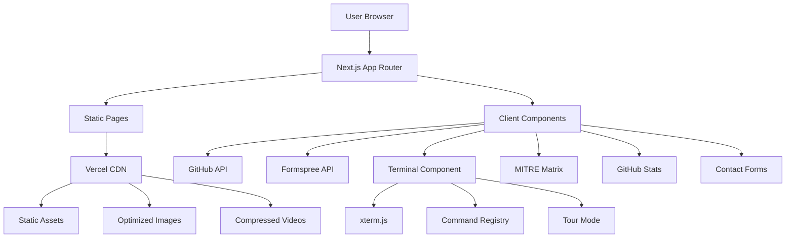
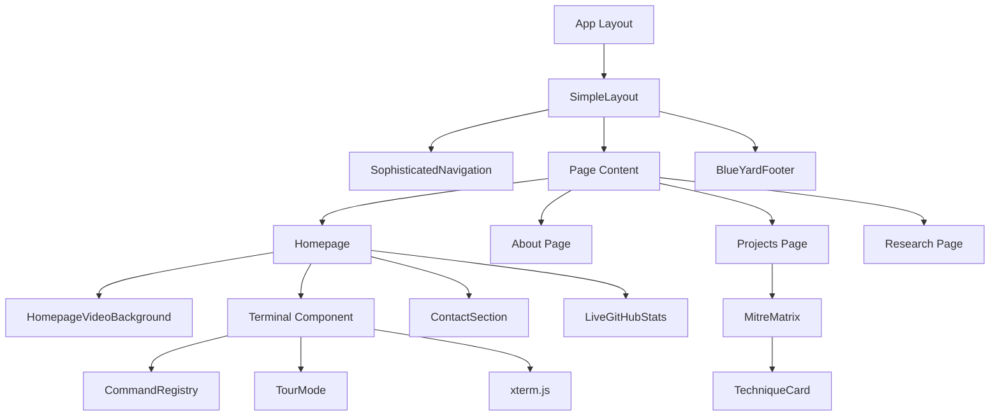

# Portfolio Architecture Documentation

This document explains the technical architecture, design decisions, and trade-offs made in building the Darrius Grate Red Team Portfolio.

## Overview

**Tech Stack**:
- **Framework**: Next.js 14 (App Router)
- **Language**: TypeScript 5
- **Styling**: Tailwind CSS 3.4
- **Animations**: Framer Motion 11
- **Terminal**: xterm.js 5.5
- **Deployment**: Vercel

**Architecture Pattern**: Static Site Generation (SSG) with Client-Side Interactivity

## System Architecture Diagram



## Core Architecture Decisions

### 1. Next.js 14 App Router

**Decision**: Use Next.js 14 with App Router instead of Pages Router or alternative frameworks.

**Rationale**:
- Server Components reduce JavaScript bundle size for static content
- File-based routing simplifies project structure
- Built-in image optimization and font optimization
- Excellent TypeScript support
- Vercel deployment integration
- Strong SEO capabilities with metadata API

**Trade-offs**:
- Learning curve for App Router conventions
- Some features still in beta (but stable enough for production)
- Server Components require understanding of client/server boundary

**Alternative Considered**: Pure React with Vite (rejected due to lack of built-in SSG and SEO features)

### 2. Static Site Generation

**Decision**: Generate all pages statically at build time.

**Rationale**:
- Portfolio content is mostly static (projects, about, services)
- Static pages have best performance (no server processing)
- Excellent SEO (all content available at load time)
- Lower hosting costs (no server runtime required)
- Better security posture (no server-side code to exploit)

**Trade-offs**:
- Content updates require rebuild and redeployment
- Dynamic features (GitHub stats) require client-side fetching

**Implementation**: All routes use default static generation, dynamic features use client components with API calls.

### 3. TypeScript Strict Mode

**Decision**: Enable TypeScript strict mode and type all components.

**Rationale**:
- Catch bugs at compile time instead of runtime
- Better IDE autocomplete and refactoring support
- Self-documenting code through type definitions
- Demonstrates professional code quality for portfolio

**Trade-offs**:
- Slower initial development (more boilerplate)
- Third-party library types sometimes incomplete
- Learning curve for complex types (generics, utility types)

**Result**: Zero TypeScript errors in production build, high code quality.

## Component Architecture

### Design Principles

1. **Separation of Concerns**: UI components separate from business logic
2. **Single Responsibility**: Each component has one clear purpose
3. **Composition Over Inheritance**: Build complex UIs from simple components
4. **Props-Down, Events-Up**: Data flows down via props, events bubble up via callbacks

### Component Hierarchy



### Key Components

#### Terminal Component
```
Terminal/
├── Terminal.tsx          # Main terminal UI and xterm.js integration
├── TourMode.ts          # Guided tour system
├── CommandRegistry.ts   # Command registration and execution
├── commands/
│   ├── index.ts         # Command exports
│   ├── attackSim.ts     # Attack simulation commands
│   └── easterEggs.ts    # Fun easter egg commands
└── utils/
    └── typewriter.ts    # Typewriter effect utility
```

**Architecture**:
- xterm.js for terminal emulation (industry-standard library)
- Command registry pattern for extensibility
- React refs for state persistence across closures
- Dynamic import to prevent SSR issues
- Tour mode uses state machine pattern

**Key Decision**: Use refs instead of state for tour mode tracking
- **Why**: Closure issues with event handlers capturing stale state
- **Trade-off**: Refs don't trigger re-renders, requires manual UI updates
- **Result**: Tour mode works reliably, proper step progression

#### MITRE ATT&CK Matrix
```
MitreMatrix/
├── MitreMatrix.tsx      # Main grid component
├── TechniqueCard.tsx    # Individual technique display
└── data/
    └── coverageData.ts  # 10 techniques mapped with 70% automation
```

**Architecture**:
- Data-driven component (all techniques in JSON structure)
- Modal pattern for technique details
- Color-coded proficiency levels
- Responsive grid layout

**Key Decision**: Static data file instead of API
- **Why**: MITRE data doesn't change frequently
- **Trade-off**: Manual updates needed when adding techniques
- **Result**: Fast loading, no API dependency

#### GitHub Stats Integration
**Architecture**:
- Client-side API calls to GitHub REST API v3
- 5-minute refresh interval
- Error boundaries for graceful failure
- Loading states for better UX

**Key Decision**: Unauthenticated API calls
- **Why**: 60 requests/hour sufficient for personal portfolio
- **Trade-off**: Rate limiting possible under heavy traffic
- **Result**: Simple implementation, no token management needed

## Performance Architecture

### Bundle Size Optimization

**Strategies Implemented**:
1. **Code Splitting**: Automatic per-route splitting by Next.js
2. **Dynamic Imports**: Terminal loaded client-side only
3. **Tree Shaking**: Unused code eliminated by webpack
4. **No Heavy Dependencies**: Avoided large libraries when possible

**Results**:
- Shared JS bundle: 87.7 kB
- Homepage total: 160 kB
- All other pages: 126-136 kB

### Image & Video Optimization

**Images**:
- Next.js Image component for automatic optimization
- WebP format with fallbacks
- Lazy loading for below-fold images

**Videos**:
- Compressed with FFmpeg (CRF 28)
- Muted autoplay for mobile compatibility
- Background videos use low bitrate

### Caching Strategy

**Static Assets**:
- Vercel CDN caching with cache-control headers
- Immutable assets with content hash in filename
- Long cache TTL for fonts, images, videos

**API Responses**:
- GitHub stats cached client-side for 5 minutes
- No server-side caching needed (static site)

## Security Architecture

### Client-Side Security

**Principles**:
1. **Trust Nothing**: All external data treated as potentially malicious
2. **Sanitize Inputs**: All user inputs validated and sanitized
3. **Fail Securely**: Errors degrade gracefully without exposing details
4. **Least Privilege**: No unnecessary permissions or API scopes

**Implementation**:
- React automatically escapes JSX (prevents XSS)
- CSP headers prevent unauthorized script execution
- No eval() or dangerouslySetInnerHTML usage
- External links use rel="noopener noreferrer"

### Configuration Management

**Environment Variables**:
```
NEXT_PUBLIC_FORMSPREE_ID    # Contact form endpoint
NEXT_PUBLIC_GITHUB_USERNAME  # GitHub stats username
NEXT_PUBLIC_GA_ID           # Google Analytics tracking
```

**Key Decision**: All variables prefixed with `NEXT_PUBLIC_`
- **Why**: Makes client-side usage explicit and intentional
- **Trade-off**: Values visible in client bundle (acceptable for non-secrets)
- **Result**: Clear distinction between public and private config

## Deployment Architecture

### Build Process

```
Local Development → Git Push → GitHub → Vercel Build → Production
```

**Build Steps**:
1. Type check with TypeScript
2. Lint with ESLint
3. Build all 14 pages statically
4. Optimize images and assets
5. Generate static files
6. Deploy to Vercel CDN

**Build Time**: ~60-90 seconds

### Deployment Strategy

**Environment**:
- Production: https://darriusgrate.vercel.app
- Preview: Automatic for all pull requests
- Local: npm run dev

**Deployment Model**: Continuous deployment from main branch
- Every push to main auto-deploys to production
- Preview deployments for feature branches
- Rollback available via Vercel dashboard

## Data Flow Architecture

### Static Content Flow
```
Markdown/MDX Files → Build Time → Static HTML → CDN → User
```

### Dynamic Content Flow
```
User → Client Component → GitHub API → State Update → UI Render
```

### Form Submission Flow
```
User → Contact Form → Formspree API → Email Notification
```

**Key Decision**: No backend server
- **Why**: Portfolio doesn't need database or server-side logic
- **Trade-off**: Dynamic features require third-party APIs
- **Result**: Simpler architecture, lower costs, better security

## Scalability Considerations

### Current Scale
- **Traffic**: Low to medium (personal portfolio)
- **Concurrent Users**: Designed for hundreds simultaneous
- **Storage**: <50 MB static assets
- **API Calls**: <12 GitHub requests/hour per visitor

### Scalability Strategy

**If traffic increases 10x**:
- Vercel CDN handles automatically (no changes needed)
- GitHub API might need authentication token (5000 req/hour)
- Contact form might need CAPTCHA for spam prevention

**If traffic increases 100x**:
- Consider caching GitHub stats server-side
- Implement aggressive client-side caching
- Add rate limiting at CDN level

**Current Bottlenecks**:
1. GitHub API rate limit (60 req/hour unauthenticated)
   - **Solution**: Add personal access token for 5000 req/hour
2. Video bandwidth (large video files)
   - **Solution**: Already compressed, consider CDN optimization

## Future Architecture Considerations

### Planned Enhancements

1. **Content Management**:
   - **Option A**: Continue with Git-based workflow (simple, version controlled)
   - **Option B**: Add headless CMS (Sanity, Contentful) for easier content updates
   - **Decision**: Defer until content update frequency justifies complexity

2. **Analytics Enhancement**:
   - **Current**: Google Analytics (basic tracking)
   - **Future**: Custom analytics for terminal usage, tour completion
   - **Implementation**: Event tracking with GA4

3. **Search Functionality**:
   - **Current**: None (not needed with small content volume)
   - **Future**: Algolia or Fuse.js for client-side search
   - **Trigger**: When content exceeds 50 pages

### Maintenance Strategy

**Dependencies**:
- Review and update monthly
- Security patches applied immediately
- Major version updates tested in dev first

**Content**:
- Projects added as completed
- Research posts added quarterly
- About page updated with new achievements

**Performance**:
- Lighthouse audits monthly
- Bundle size monitoring continuous
- User analytics reviewed weekly

## Technical Debt

### Acceptable Debt
1. **Hardcoded Values**: Some constants still inline (low impact)
2. **Static Day Counter**: Manually updated (low effort to automate)
3. **Limited Test Coverage**: No unit tests (static site, low risk)

### Planned Improvements
1. Extract all magic numbers to constants file
2. Add basic test coverage for complex components
3. Implement automated performance budgets

## Lessons Learned

### What Worked Well
1. **App Router**: Server Components reduced bundle size significantly
2. **TypeScript**: Caught bugs early, improved code quality
3. **Tailwind**: Rapid styling without CSS bloat
4. **Static Generation**: Excellent performance and SEO

### What Could Be Improved
1. **Terminal Component**: Complex closure management, could be refactored
2. **Tour Mode**: State machine could be more explicit
3. **Testing**: Should have added tests before complexity grew

### Key Insights
1. **Keep It Simple**: Static sites are powerful, don't over-engineer
2. **Performance First**: Users notice slow sites immediately
3. **Security Mindset**: Even simple sites need security considerations
4. **Document Decisions**: Future self will thank you

---

**Document Version**: 1.0  
**Last Updated**: January 18, 2025  
**Author**: Darrius Grate  
**Next Review**: Major feature additions or framework updates
